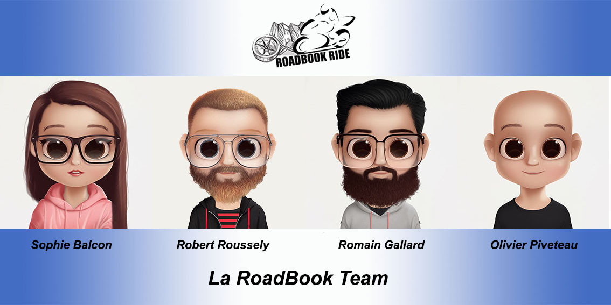
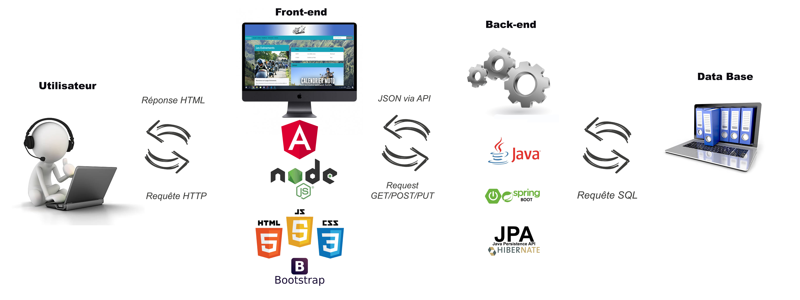

# Projet fil rouge


Nous avons le plaisir de vous présenter RoadBook Ride, une application communautaire 100% dédiée aux motards !<br/>
RoadBook Ride vous permet de profiter de RoadBooks, d’articles, d’événements et autres services créés par la communauté.<br/>
### ROADBOOKS MOTO : (partie en chantier)
Les motards partagent leurs roadbooks à travers toute la France et la communauté en profite. Et grâce à Robert (et aussi beaucoup grâce à Jean-Pierre et Thomas…), vous pourrez même vous géolocaliser !!!<br/>
### ARTICLES :
Un fil d’actualités est mis à votre disposition pour échanger, publier et partager.<br/>
### SERVICES :
Les motards partagent leurs compétences, proposent des services… Cette page peut être votre alliée au quotidien. <br/>
### BALADES ET ÉVÉNEMENTS : 
Tous les événements et balades sont ajoutés par les membres. Les utilisateurs situés à proximité du lieu de rendez-vous sont notifiés par email et notifications mobiles.<br/>

## Membres du projet :
Nous sommes fières de vous présenter la RoadBook Team



https://docs.google.com/document/d/1_GBlj-ltqSKCLcIOpHSGGh2gK36yKEEFBCuBlj5qUNU/edit

## Trello
https://trello.com/b/WpmMKhwL/commumoto

## Maquette
https://marvelapp.com/80i1ag5

## Diagramme de l'application


## Description
Une application web qui permet aux motards utilisateurs de partager leurs expériences.<br/>

### La page d'accueil se compose :
* D'une bannière avec le logo de l'application.
* D'une NavBarre avec :<br/> 
Un lien de connexion utilisateurs.<br/>
Un lien vers les roadbooks : consultation et création.<br/>
Un lien vers la page événements<br/>
Un lien vers la page services<br/>
Une barre de recherche<br/>
* Une Card pour présenter l'application avec un lien vers la page "Articles".
* La carte de France avec les départements cliquables (qui ne renvoie à rien pour le moment...).
### La page Articles :
Cette page parmet de consulter des articles. Et, seul un utilisateur connecté pourra apporter sa contribution en publiant un article via un formulaire qui s'ouvre sur une autre page. Cet utilisateur a également la possibilité de supprimer un article.
### La Page RoadBook : 
Cette page est en cours de création.
### La Page Evénements : 
Cette page offre la possibilité de consulter les événements proposés par la communauté. En cliquant sur un événement, les détails de celui-ci s'affiche dans la carte sous la liste. Un utilisateur a alors la possibilité de le modifier, le supprimer et de revenir à la liste principale.<br/>
Il peut aussi ajouter un événement via un bouton qui ouvre un formulaire sur une nouvelle page.
### La Page Services :
Cette page propose aux utilisateurs de consulter les services offerts par la communauté. Et, seul un utilisateur connecté pourra apporter sa contribution en proposant un service via un formulaire qui s'ouvre sur une autre page. Cet utilisateur a également la possibilité de supprimer un service.
### La Partie Connexion/Inscription :
* L'onglet "connexion" de la navbarre permet a l'utilisateur déjà inscrit de se connecter, et au nouvel utilisateur de s'inscrire via un bouton qui ouvre un nouveau formulaire. 
* L'onglet "profil" permet à l'utilisateur connecté de visualiser et mettre à jour sont profil.
### Le Footer :
* Un onglet "mentions légales" qui permet de les consulter.
* Un onglet "nous contacter" qui comprend un formulaire ne permettant pas encore d'envoyer un mail à l'équipe...
* Un onglet "la Roadbook Team" qui renvoit sur la présentation de l'équipe. 
* Un onglet "plan du site", encore inactif... On verra quand l'application sera plus aboutie.


## Répartition des taches :
Nous avons travaillé tous ensemble sur le MCD et les tables. 
### Sophie :
Sophie s'est occupée de la partie design du projet et de la maquette. Elle a réalisé la partie "Evénements" de l'application.<br/>
### Olivier :
Olivier a réalisé les uses cases. Il s'est occupé de la partie connexion et inscription de l'application. Il a également créé la carte de France, avec les départements cliquables. <br/>
### Romain :
Romain est le Git Master du repo GitHub concernant la partie backend de l'application. Il a pris en charge toute la partie concernant les "Articles".<br/>
### Robert :
Robert est le Git Master du repo GotHub concernant la partie Frontend de l'application. Il est l'auteur de la partie "Services". Et, il nous géolocalise.<br/>


## API utilisée 
Nous utilisons OpenStreetMap comme API pour la carte.


## Use Cases


#### Scenarios des Use Cases

###### Scénario 1 : Un utilisateur (inscrit ou non) veut découvrir des itinéraires de balades dans sa région.

L'utilisateur lance l'application / se rends sur le site Roadbook-ride. Depuis le menu - barre de navigation - de la page d'accueil, il accède à la page des roadbooks.
Les roadbooks les plus populaires (toutes régions confondues) apparaissent à l'écran, sous la forme de fiche récapitulatives (nom, kilomètrage, temps estimé, nombre d'étapes... aperçu trajet ?)

Il clique sur la petite carte de France pour l'agrandir et sélectionner sa région.
Puis l'utilisateur clique sur sa région. La carte se réduit et la liste des roadbooks affichés se met à jour pour présenter les roadbooks les plus populaires parmi ceux localisés à proximité.

Il fait défiler la liste jusqu'à en trouver un dont le point de départ se trouve près de chez lui. Un rapide coup d'oeil sur la fiche récapitulative l'informe de la distance et du temps estimé (deux jours, parfait pour une sortie sur un week-end)

Ce roadbook ayant attiré son attention, il clique sur sa fiche pour accéder aux détails.

Il peut à tout moment revenir à la liste des Roadbooks.


###### Scénario 2 : Un utilisateur (inscrit) souhaite organiser un évènement.

L'utilisateur lance l'application / se rends sur le site Roadbook-ride. Au besoin, il se connecte avec ses identifiants.
Depuis le menu - barre de navigation - de la page d'accueil, il accède à la page des évènements.
En dessous de la liste des évènement, il clique sur 'ajouter un évènement', qui ouvre un formulaire.

Il remplit les champs obligatoires (nom, type d'évènement, description, date) et optionnels [ajouter ici comment se passe la sélection d'un RB] , et valide.

Le formulaire se referme, une notification l'informe que son évènement a bien été enregistré, il est renvoyé sur la page des évènements.

Il peut immédiatement vérifier que son évènement est bien listé en effectuant une recherche par nom sur cette même page.

## MCD


## Endpoints
Concernant les Endpoints, nous avons respecté le principe du CRUD dans les controller principaux. 
<br/>
Voici quelques exemples : <br/>
### Pour le "C" de CRUD : CREATE :
```java
	@PostMapping("/addEvenement")
	public Evenement ajoutEvenement(@RequestBody Evenement evenement){
		return evenementRepository.saveAndFlush(evenement);
	}
```

### Pour le "R" De CRUD : READ :
```java
	@GetMapping("/articles")
	public Collection<Article> findAll(){
		return articleRepository.findAll();
	}
```
### Pour Le "U" De CRUD : UPDATE : 

```java
    @PutMapping("/updateEvenement")
    	public ResponseEntity<Evenement> updateEvenement(@RequestBody Evenement evenement) {
    
    		Optional<Evenement> evenementEnBase = evenementRepository.findById(evenement.getId());
    			
    		if(evenementEnBase.isPresent()) {	
    			// Si l'utilisateur ne renseigne pas certains champs, on leur donne par défaut leur valeur actuelle plutôt que de les écraser avec un null
    
    			if(evenement.getType().isEmpty()) {								
    				evenement.setType(evenementEnBase.get().getType());		
    			}
    			if(evenement.getImageUrl().isEmpty()) {
    				evenement.setImageUrl(evenementEnBase.get().getImageUrl());
    			}
    			if(evenement.getDescription().isEmpty()) {								
    				evenement.setDescription(evenementEnBase.get().getDescription());		
    			}																	
    			if(evenement.getNom().isEmpty()) {
    				evenement.setNom(evenementEnBase.get().getNom());
    			}
    			if(evenement.getDate() == null) {
    				evenement.setDate(evenementEnBase.get().getDate());
    			}
    			if(evenement.getRegion() == null) {
    				evenement.setRegion(evenementEnBase.get().getRegion());
    			}
    			if(evenement.getUtilisateur() == null) {
    				evenement.setUtilisateur(evenementEnBase.get().getUtilisateur());
    			}
    			if(evenement.getRoadbook() == null) {
    				evenement.setRoadbook(evenementEnBase.get().getRoadbook());
    			}			
    			return new ResponseEntity<>(evenementRepository.saveAndFlush(evenement), HttpStatus.CREATED); 
    	
    		} else {
    			return new ResponseEntity<>(evenement, HttpStatus.NOT_FOUND);
    		}
    	}
    	
```

### Pour le "D" de CRUD : DELETE :
```java
    @DeleteMapping("/delService/{id}")
    public void delOne(@PathVariable int id) {
        Optional<Service> optService = serviceRepository.findById(id);
        if (optService.isPresent()) {
            serviceRepository.deleteById(id);
            System.out.println("Action supprimée");
        } else {
            System.out.println("Pas d'action à supprimer");
        }
    }
```

### Pour effectuer une recherche (ici par "Tag") :
```java
@GetMapping("/articlesByTag/{tag}")
	public List<Article> findByTag(@PathVariable String tag) {
		return articleRepository.findAllByTagContainingIgnoreCase(tag);
	}
```

